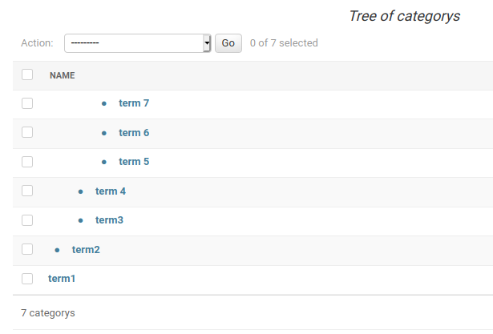

# Django Taxonomy
> :warning: **Due to a name clash** This code is in Python repositories named as "django-taxonomy2".

Create categories in a tree structure.

This app is called 'django-taxonomy', but internally the module is called 'taxonomy'.

## Alternatives

- [django-packages](https://github.com/callowayproject/django-categories)
    This project is mature with many commits. It uses an MPTT implementation.

- [django-treebeard](https://github.com/django-treebeard/django-treebeard)
    Django Treebeard is mature, has multiple tree implementations, an API, and AJAX Admin. It's a legendary Django package. It can do everything this package can do and much more.

- [django-modelcluster](https://github.com/wagtail/django-modelcluster)
    This is a chunk of the Wagtail CMS. It allows you to join model objects together, even as they are created, then save in a chunk. Not quite the same thing as a taxonomy, but it does define relations between models, so if you are looking for that, it may be a fit.

- [django-taxonomy](https://pypi.org/project/django_taxonomy/#files)
    Still there as a package. Looks like it was intended as a Drupal port, long ago.

- [django-treenav](https://djangopackages.org/packages/p/django-treenav/)
    Makes interesting reading what is in it, but not sure what it is. I think it may do what this does? Not investigated too far.

 
## Why you may or may not want this app
Pro
- It's simple
- Nodes (Categories) can be customised
- It's got displays and Admin builtin 
- Comprehensive and acessible API

Con
- No multi-parent (node map) option
- Poor at finding descendant elements, so poor the functionality has not been implemented
- For 500 lines of code, a lot of README
- tests [Ummm](#tests)

If you want the standard, get [TreeBeard](https://github.com/django-treebeard/django-treebeard). If you are building a shopping site, you want an MPTT or maybe Treebeard's PathTree implementation. This is not that app.

This app has only one (non)feature over the heavyweights. It is simple. 
It has no dependencies. It has only 500 (or near) lines of core code. It has a bone-simple SQL layout, you can fix it with 'dbshell'. If you don't need the weight, but want to catalogue some uploads, or gather pages on a website, you may prefer this.

I know it's unprofessional to think of performance, but I tried creating 30,000 categories on an old laptop with an SQLite DB. Slow changes but reading fast. Of course, the displays fell to pieces.

## Overview
The app is called Taxonomy, because that's what it is, a vocabulary of terms. You might think of that as a tree of categories. However, I've used the common Python/Django word 'Node' for the categories.

To make a tree of categories, Taxonomy has a model 'AbstractNode'. You subclass 'AbstractNode' to make a new Model. One Model/database table = one tree. 

'AbstractNode' can be extended with whatever data you want. So a Node (category) can be customised with descriptions, SEO material, external reference numbers, whatever you need to reference and present your material.

'Node' is not a good name for end users. Whenever end users are concerned, I'd use the word 'category'. Even in the application help I use the word 'Category'.

Any Node/Category can have Elements attached. An Element is any Django Model instance. The join is usually through a Foreign key.

## If you have done this before
- Install
- Declare a taxonomy
- [Add an Admin](#Admin)

I think that's all. Use the [API](#the-api) to access the taxonomy, and foreign keys to [add objects](#attaching-objects).

## Install
PyPi,

    pip install django-taxonomy2

Or download the app code to Django.

Declare in Django settings,

        INSTALLED_APPS = [
            ...
            'taxonomy.apps.TaxonomyConfig',
            ...
        ]

There will be migrations, but not for the app. That comes after you have declared a tree. See next section.

## Creating a Taxonomy
Often, a taxonomy is associated with one model/object. In which case, you can create the taxonomy in the model for the app. If you use [Multiple Models](#multiple-models) it may be better to create the taxonomy in a freestanding app e.g.

    /manage.py startapp sitecategory

and install. Either way, here is an example of a model declaration. This adds a 'description' field, so the taxonomy can be used for more helpful user display. It also includes a 'slug' field, so the category titles can be used in URLs. That means the model has a get_absolute_url() method too (see below),
        
    from django.db import models
    from django.urls import reverse
    from taxonomy.models import AbstractNode, AbstractNodeParent
    from taxonomy.api import NodeTreeAPI

    class SiteCategory(AbstractNode):

        # Not unique. Node names may be duplicated at different places in a 
        # hierarchy e.g. 'sports>news', 'local>news'. but it may save later
        # trouble to make them unique...
        slug = models.SlugField(
            max_length=64,
            help_text="Short name for use in urls.",
        )
      
        description = models.CharField(
            max_length=255,
            blank=True,
            default='',
            help_text="Description of the category. Limited to 255 characters.",
        )
          
        def get_absolute_url(self):
            return reverse("category_detail", kwargs={"slug": self.slug})

        api = None

        def __repr__(self):
            return "SiteCategory(id:{}, name:{}, slug:{}, weight:{})".format(
                self.id,
                self.name,
                self.slug,
                self.weight,
            ) 

    # Always the same, but a new class needed for every taxonomy.
    class SiteCategoryParent(AbstractNodeParent):
            pass
                    

    # Always this format, but a new instance needed for every taxonomy.
    SiteCategory.api = NodeTreeAPI(
                SiteCategory, 
                SiteCategoryParent, 
             ) 

Note that I called the new Node, and hence tree of nodes, 'SiteCategory'. You'll probably want to include the model name of attached elements somewhere, to avoid clashes if you have two or three taxonomies. 'Category' alone is too generic. 'ImgCategories' is probably better.

Then migrate.

## Admin
NB: Even though the data is available, I have not found a way to push into Admin, which is obsessed with queryset machinery. Hence the funny bullet display.
 
You need a special admin found in 'taxonomy.admins'. The admin adds a 'parent' field to Node forms, and routes CRUD operations through the API.

As usual, the admin needs a 'fields' attribute. One comment here, if you do not have a 'fields' statement, the 'parent' field is placed at the bottom of the form. This is probably not what you want. Also, you will want the 'parent' field to show in most cases, so put 'parent' in the 'fields' list. 

You can customise as usual. Here I've added a 'prepopulate' attribute for the slug field added to the SiteCategory node in the example above,

    from django.contrib import admin
    from ???.models import SiteCategory
    from taxonomy import admins

    class SiteCategoryAdmin(admins.CatAdmin):
        fields = ('parent', 'name', 'slug', 'description', 'weight')
        prepopulated_fields = {"slug": ("name",)}
    admin.site.register(SiteCategory, SiteCategoryAdmin)

There we are,

## The API
As an app, Taxonomy is spread across DB tables which need code to manipulate them. The code is gathered into a manager. Since this is not the same as a Django (QuerySet) Manager, I've called it an API, not a manager. You'll use it for access to taxonomy data (unless you're hacking or have a broken installation).

The api hangs off any object based on AbstractNode, and can also be accessed from any AbstractNode class. Using the model created above, SiteCategory,

    from sitecategory.models import SiteCategory

    api = SiteCategory.api

The api is also present on any AbstractNode object,

    from sitecategory.models import SiteCategory

    obj = SiteCategory.objects.get(id=1)
    obj,api

The attribute 'api' exposes methods for a tree,

    delete() (whole tree)
    save() (a Cat)
    tree()

e.g.

    obj,api.delete()

deletes the whole tree, i.e. all nodes (including 'obj'), all other data, and cache. 

You can call the API with a Node id, which gives you methods for a single Node,

    from sitecategory.models import SiteCategory

    # node = node with id=4
    node = SiteCategory.api(4).node()

The call also accepts get() parameters, like the Django objects manager objects.get(), which can be handy,
 
    node = SiteCategory.api(name='dvds').node()

So,

    Category.api(7).node()

returns the same result as,

    Category.api(id=7).node()

...but the simple integer parameter does no initial DB lookup.

The call exposes many node-specific methods. For making pages, the simple-named methods return full node data,

    parent()
    children()
    ascendant_path()
    descendant_paths()
    tree(self, max_depth=None)

e.g.

    SiteCategory.api(id=7).tree()

returns a tree descending from Node id=7.

Some of the other methods only deal with DB ids.

The structure of tree data is worth mentioning. It is usually a flat tree of depth and Node data coupled in a Tuple, gathered into a list,

    [
        (0, Node1)
        (1, Node2)
        (1, Node3)
        (0, Node4)
        (1, Node5)
        (2, Node6)
        (3, Node7)
        ...
    ]

This is the kind of data the app uses to render the select boxes in Admin.

One point worth knowing is that, since these taxonomies are single-parent, there can be only one path back to the root. But there can be several paths towards leaves. Ask for descendant_paths() and you will get a list of lists.

### Accessing taxonomy data
You can use the API in the shell, but also jamb it statically into a webpage. For example, here are the root categories in a tree, 

    from taxonomy import NO_PARENT

        ctx['root_elements'] = SiteCategory.api(NO_PARENT).children()

pushed into a navbar with some CSS,

## Attaching objects
### Category recorded in object
This is the way most people think about this. A model 'Page' has a category of 'Psychology'.

You'll need to add a field to your Model. Usually you would use a ForeignKey (unless your data can fall into many categories. In that case, use a ManyToManyField).

    ...
    from sitecategory.models import SiteCategory

    class Page(models.Model):
        category = models.ForeignKey(
            SiteCategory,
            on_delete=models.CASCADE,
            related_name='+',
        )

CASCADE means if the Node is deleted, the element is deleted also. One day this will be an important decision. If you want to keep material when the taxonomy is changed or discarded, use SET_NULL or SET_DEFAULT. 

Also [related_name selects are switched off](https://docs.djangoproject.com/en/3.1/ref/models/fields/#django.db.models.ForeignKey.related_name). Related name selects will let you see a node and find the objects attached to it. But I'll be ok searching Page for elements in a category. Your choice.

It's possible you may want to leave an object without a parent. That could mean 'unpublished', or "don't destroy with the category". To do that, enable null or a default on the field,

    from taxonomy import UNCATEGORIZED

    class Page(models.Model):
        category = models.ForeignKey(
            Category,
            blank=True,
            default=UNCATEGORIZED,
            on_delete=models.SET_DEFAULT,
        )

UNCATEGORIZED is a sentinel value from the app. I'm not fond of null in DB's, but you can use null if you want.

This model will deliver the usual Django display in Admin, a ModelChoiceField, which is ok. If you have many Nodes you may want to try [autocomplete](https://docs.djangoproject.com/en/3.1/ref/contrib/admin/#django.contrib.admin.ModelAdmin.autocomplete_fields) or [raw id](https://docs.djangoproject.com/en/3.1/ref/contrib/admin/#django.contrib.admin.ModelAdmin.raw_id_fields) widgets.

### Attached object views
Let's say this object is set up, and has a DetailView. There's much taxonomy detail you can recover and use to extend the functionality of the page. This is discussed in more detail in [rendering](#rendering), but this is how to get the data,

    def get_context_data(self, **kwargs):
        ctx = super().get_context_data(**kwargs)

        if self.object:
            category = self.object.category
            # get the path to root
            ctx['crumb_nodes'] = category.api(category.id).ascendant_path()
            # child nodes
            ctx['child_categories'] = category.api(category.id).children()
            # disorganised collection of descendant nodes
            ctx['descendant_categories'] = category.api(category.id).descendants()
            # get sibling objects (in the same category)
            ctx['siblings'] = self.model.objects.filter(category=category)
        return ctx

Then render.

### Multiple models
If you follow this method for attaching-objects then different models can be attached to the same taxonomy nodes. The taxonomy knows nothing about the attached objects, and CRUD manipulation of the Taxonomy will work as you hope. For example, if the foreign key is set to cascade deletes, delete a node and attached objects will be deleted, even in different models.

This can get messy in a few ways. First, you'll need to think about how to handle objects returned from nodes, because they may be from different models. Perhaps a base model will help, so you can guarantee consistent handling? 

Second, if you use Django's related managers, multiple models will create multiple related managers. Every different model you add to a taxonomy will add a new manager until each Node has a list like 'info_page_set', 'article_set', 'code_article_set', and more. There's two basic approaches. Either accept multiple managers, and try to be consistent. Or turn off related lookups and, if you need a list of elements, search the original models. Either way, you need to think if you are searching for elements of one type attached to a node (easy), or elements of any type (needs organisation).

### Notes
I would point out the above is not the only way. Objects can be recorded against categories. Not only is the above not the only way, I don't like it. I'd prefer category data did not intrude on objects. However, [Django has no ability](#the-evironment).

## Rendering
First I want to say this, and am going to shout,

> :warning: This app's rendering acilities are not a settled API and may in the future change

Right, let's move forward. There are a lot of options which are nothing to do with this app, they are conceptual. What do you want to render?

The overview of Django rendering is,
- In a view, using the API, retrieve data from a taxonomy, then...
- Render HTML immediately to push, throught the context, into the template, or...
- Push data into a context then use template tags to semi-automatically render, or...
- Render data in the template usuing template facilities
Of these options, regading this module in particular, rendering in the view is the most flexible, but muddles logic and HTML. Template tags are tidiest, but inflecible and may need writing (which is time consuming for small efforts). As for using template facilities, the data returned by the API is complex, so may outreach the abilities of template rendering. 

The app currently contains a few solutions.

Let's say...

### Using template facilites for breadcrumbs
You have a model linked to a taxonomy. 
 

With some CSS work.

Stock Django. Add some taxonomy data to the model View, 

    from django.views.generic import ListView, DetailView
    from page.models import Page

    class PageDetailView(DetailView):
        model = Page
        context_object_name = 'page'
        
        def get_context_data(self, **kwargs):
            ctx = super().get_context_data(**kwargs)
            if self.object:
                # cranky, but avoids Taxonomy import
                category = self.object.category
                ctx['crumb_nodes'] = category.api(category.id).ascendant_path()
            return ctx

Then, in the template 'page_detail.html', render 'crumb_nodes'. Can do that explicitly, 

   <nav class="topbar">
        <ul>
            
            <li class="menu-item">
                {{ node.name }}
            </li>
            
        </ul>
    </nav>

Now do your CSS.

### Using the inline-templates
There are several pieces of code used to render taxonomy data directly in a view. These are all in 'inline-templates.py'. The current renderers are,

- FlatTreeRenderer
- FlatTreeRendererAsLinks
- NodeListRenderer
- NodeListRendererAsLinks
The base methods generate text displays, the ...AsLinks subvlasses generate HTML anchors.

The classes are used by generating an instance, then calling the method rend() with some data. Showing two of the vlasses at work, in a view put something like this,

        tree = ArticleCategory.api.tree()
        tr = FlatTreeRendererAsLinks()
        rend_tree = tr.rend(
            tree, 
            list_attrs={'class':"category-tree"}, 
            data_attrs={'class':"category-anchor"}
            )
        ctx['category_tree'] = mark_safe(rend_tree)
        
        crumb = ArticleCategory.api(id=7).ascendant_path()
        nr = NodeListRendererAsLinks()
        rend_breadcrumb = nr.rend(
            crumb,
            data_attrs={'class':"bc-anchor"}
            )
        ctx['breadcrumb'] = mark_safe(rend_breadcrumb)

Then in the view template summon the template variables. Note that, like Djano form rendering, the template must provide the surrounding HTML list element declarations,

    <ul class="breadcrumb">
        {{ breadcrumb }}
    </ul>
    <ul class="toc toc-list groove">
        {{ category_tree }}
    </ul>

That's it. 

### Extra (unsupported) render code
There are several other pieces of code for rendering. All are working, all are not completed or unified, so may be changed in the future.

#### Flat Trees
Trees made of node data plus a depth. As used in the selector boxes in admin.

The tags and classes return HTML.

##### FlatTreeRendererMark
Renders a tree, but depth is indicate by a flexible mark, not nested HTML lists,

##### AnchorFlatTreeRendererMark
A FlatTreeRendererMark rendered with anchors e.g.

    from django.utils.safestring import mark_safe
    from taxonomy.models import SiteCategoryNode
    from taxonomy.inline_templates import AnchorFlatTreeRenderer

    class CategoryDetailView(DetailView):
        ...
        def get_context_data(self, **kwargs):
            ctx = super().get_context_data(**kwargs)
            tree = Category.api.tree()
            tr=AnchorFlatTreeRenderer()
            rend_tree = tr.rend(tree)
            ctx['nav_tree'] = mark_safe(rend_tree)
            return ctx

#### Stacked Trees
Trees that display nodes on top of each other, extending downwards like roots on a plant.

These displays use a lot of visual space. Only a small taxonomy can be displayed. And, as you can see, the classes and tags return SVG graphics. 

##### StackTreeRenderer
For example,

    from django.utils.safestring import mark_safe
    from taxonomy.models import SiteCategoryNode
    from taxonomy.inline_templates import StackTreeRenderer

    # lightly customise the renderer to colour the beam and stem marks
    class PrettyStackTreeRenderer(StackTreeRenderer):
       beam_style = 'stroke:darkseagreen;stroke-width:4;stroke-linecap:square;'
       stem_style = 'stroke:darkseagreen;stroke-width:2;'

    class CategoryDetailView(DetailView):
        ...
        def get_context_data(self, **kwargs):
            ctx = super().get_context_data(**kwargs)

            # Get a tree
            tree = SiteCategoryNode.api.tree()

            # Rend
            tr = PrettyStackTreeRenderer()
            rend_tree = tr.rend_default(tree, 300, 12)

            # Deliver into a template
            ctx['cat_tree'] = mark_safe(rend_tree)
            return ctx

In the template,

            {{ cat_tree }}

To modify further, look at code. 'text_style', 'beam_style' and 'stem_style' can be overloaded (different colors/widths/cap-style). Use 'rend', instead of 'default_rend' to modify gaps and distances. Different data can printed by overloading 'get_context' and 'data_template'.

##### AnchorStackTreeRenderer
Inline SVG is live DOM code and can render working anchors,

    from taxonomy.inline_templates import AnchorStackTreeRenderer

    ...
        def get_context_data(self, **kwargs):
            ctx = super().get_context_data(**kwargs)

            # Get a tree
            tree = SiteCategoryNode.api.tree()

            # Rend
            tr = AnchorStackTreeRenderer()
            rend_tree = tr.rend_default(tree, 300, 12)

            # Deliver into a template
            ctx['cat_tree'] = mark_safe(rend_tree)
            return ctx

To customise, AnchorStackTreeRenderer can be overridden like StackTreeRenderer.

#### Notes on SVG graphics
Notes,

- The output image should auto-size into any webpage container it is placed in. Including browser resizing.
- It is an image. Text size is fixed, and will not respond to page zoom 
- After generation, the web delivery load is very low...
- ...but the SVG image puts extra load on the receiving browser

The render works by writing node data into boxes, which are laid out according to node hierarchy. To make text smaller, try make the 'x' size larger (which scales text down).

#### Template tags
There are several template tags which can deliver the treerenderers. Sorry, but I not worked them through.

For rxample, there's a template tag that prints a depth tree in HTML. It is easy to use, though operation is limited,

Use a view to send a tree (the usual depth-Node type),

    from sitecategory.models import SiteCategory
        ....
        ctx['site_tree'] = SiteCategory.api.tree()

Render that data in a template with this tag,

    
        ...
        

## Considering URLs for Taxonomies 
What we mean by presenting a taxonomy to users is making URLs to point to nodes, then presenting nodes as a View.

Not all taxonomies will need URLs. Taxonomies can be used for internal organisation. But a taxonomy with URLs can make the base of a site. For example, a few CMS now assume that pages on a site are organised as a tree.

### Planning
All kinds of fancy pages nowadays, but a classic web navigation page for a directory would be a list of sub-directories and files. Navigate to a category on most sites and you will find lists of attached elements. But if you have a search page enabled on your site, maybe you would want to go to that? That's a different kind of URL.

If you want pages for node/categories, you need to decide how your URLs will look. Will element URLs include a subject? There is advice [they should not](https://www.w3.org/Provider/Style/URI). But then the URL is not so hackable, which is also a case.

I've not worked on a full URL solution. Here is a 'distracted' URL solution, that retains elements at their Django URLs (e.g. host/page/xxx) but provides breadcrumbs and category listings.

Anyway, lets start with...

### Taxonomy data as anchors
You start with rendering taxonomy data as anchors. This will happen in some View. You use the API to deliver some data to a template.

If the model has a field 'slug', and is a list of nodes, the app has a templatetag,

    <nav>
        
    </nav>

which accepts optional args,

    url_prefix
        to go before the slug. Default '/category/'
    url_id_field
        fieldname for id data for the URL. Default 'slug'

Other keyword arguments are rendered as HTML attributes.

The templatetag has not much control over rendering, but maybe you don't need that. The tag above renders as,

    <ul class="breadcrumb">
        <li><a href="/category/node_1">node 1</a></li>
        <li><a href="/category/node_2">node 2</a></li>
        ...
    </ul>

Unless you've built some taxonomy Views, these links don't point at anything. But it's a start.

### Declare a Node model with a slug field
You can, and sites do, have URLs like,

    [host]/sitecategory/4

If it won't be important for users, this is simple and clean. But if you'd like something more visual, add a slug field to the node model. Then the URL can look like,

    [host]/sitecategory/shrubs

Now a View.

### Node views
Wherever the taxonomy is located, make a DetailView for the Nodes. Note this isn't a ListView. Sure, we are listing things, but the basic idea here is 'something to do with a single category', not 'list of categories',

    from django.views.generic import DetailView
    from sitecattegory.models import SiteCategory
    from page.models import Page

    class SiteCategoryDetailView(DetailView):
        model = SiteCategory
        context_object_name = 'sitecategory'

        def get_context_data(self, **kwargs):
            ctx = super().get_context_data(**kwargs)
            if self.object:
                # You chould shovel in some breadcrumb data
                ctx['crumb_nodes'] = self.object.api(self.object.id).ascendant_path()

                # ...or a list of descendant Nodes            
                ctx['descendant_nodes'] = self.object.api(self.object.id).descendants()

                # ...or element data from this category (this could use a related query if you have set up like that)
                ctx['elements'] = Page.objects.filter(category=self.object)
            return ctx

And a template, sitecategory_detail.py. For example,

    
    

    {{ sitecategory.name }}
    template-sitecategory

    
    <nav>
        
    </nav>
    

        <header class="sitecategorydetail-header">
            
Topbar

        </header>

        

            <h1>{{ sitecategory.name }}</h1>
            <h2>Sub-categories</h2>
            
            <h2>Elements</h2>
            
{{ elements }}

        

    

    

You'll want to do more than this. Underneath these pages is a category View, but nowadays people go berserk with them. Import your site logos, messaging and navigation templates. Jamb the descendant Node data into menus. If you keep the elements on the page, make them into a list of image anchors. Load with search bars, gadget images, manipulative headlines, and entrapment buttons. Time to express yourself.

### Category URLs
Now need to wire in the View. Add a link in your URLs file,

    from sitecategory.views import SiteCategoryDetailView

    urlpatterns = [
        path('sitecategory/<slug:slug>',  SiteCategoryDetailView.as_view(), name='sitecategory_detail'), 
    ]

Then maybe a reverse URL on the Category model. That would give in Admin a 'View on site' button,

    def get_absolute_url(self):
        from django.urls import reverse
        return reverse('sitecategory_detail', kwargs={'slug': self.slug})

Done.

## Implementation notes
There are a few ways to implement a tree.

### Creating a Root Node
You can set any number of nodes at base. If you would like a taxonomy with a singular base, start a single node which will be the 'root'. Build from there e.g. ::

    base = 'car categories'
    - Cars
    -- saloon 
    -- hatchback 
    -- sport
    ...
  
etc.

### Tests
So far I have not found a way to test this app without Python ducktape. There are tests.  They are in a directory 'ttest'. This is a full app.

To run the tests you must install django-taxonomy, then move 'ttests' to the top level of a project. Install,

    
        INSTALLED_APPS = [
            ...
            'ttest.apps.TTestConfig',
            'taxonomy.apps.TaxonomyConfig',
            ...
        ]

...and migrate. The tests are in the ''tests' sub-folder of 'ttests'.

## EndNote
### The environment
The Django system presents substantial difficulties to anyone implementing structures like this. There is the issue of the ORM and foreign keys, about which you can say nothing, or write a book. Form-building seems flexible, but you can't pin partials together, nor integrate with Admin. And admin may be customisable, but it's a blob of code and can not be extended. The only functionality on the coder's side is Django's model building, and Python hackability. It's clear other projects have wrestled with these issues. I'm just working as I can to make something usable.

### Straight vs. MPTT etc. implementation
Django-taxonomy uses direct links between its tree nodes. This is fundamentally different to an MPTT structure, which links tree nodes as a list, or a path structure. It's something like the difference between an array and a linked list. They both present a similar API, but the underlying implementation is different. There are advantages to both. An MPTT structure is excellent at gathering data from multiple categories, say 'cars' and all sub-categories. It is also capable of ordering it's categories and references exactly. Whereas the straight structure is poor at this, and I have not implemented either functionality. But the straight structure is simple to create and maintain, and good at displaying the categories themselves.
