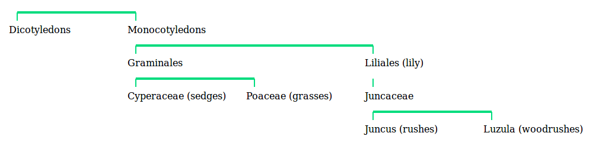

# Django Taxonomy
Create categories in a tree structure.

This app is called 'django-taxonomy', but internally the module is called 'taxonomy'.

## Alternatives

- [django-packages](https://github.com/callowayproject/django-categories)
    This project is mature with many commits. It uses an MPTT implementation.

- [django-treebeard](https://github.com/django-treebeard/django-treebeard)
    Django Treebeard is mature, has multiple tree implementations, an API, and AJAX Admin. It's a legendary Django package. It can do everything this package can do and much more.

- [django-modelcluster](https://github.com/wagtail/django-modelcluster)
    This is a chunk of the Wagtail CMS. It allows you to join model objects together, even as they are created, then save in a chunk. Not quite the same thing as a taxonomy, but it does define relations between models, so if you are looking for that, it may be a fit.
 
## Why you may or may not want this app
Pro
- It's simple
- Terms are subclassed and can be customiised
- It's got displays and Admin builtin 

Con
- No multiparent (node map) option
- Poor at finding descendant Term elements, so poor the functionality has not been implemented

If you want the standard, get [TreeBeard](https://github.com/django-treebeard/django-treebeard). If you are building a shopping site, you want an MPTT or maybe Treebeard's PathTree implementation. This is not that app.

This app has only one (non)feature over the heavyweights here. It is simple. 
It has no dependencies. It has only 300 (or near) lines of core code. It has a bone-simple SQL layout, so simple you can fix it with 'dbshell'. So if you don't need the weight, but want to catalogue some uploads, or gather pages on a website, you may prefer this.

## Overview

Taxonomy has a model 'TermBase', which you can extend with whatever data you want. Every subclass of TermBase becomes a tree of terms. 

The base is called 'Term' because, well, that's the name (sometimes people use 'Node'). It's not really a Category because the full structure, a Taxonomy, is a tree of Terms, not a freestanding or otherwise organised set of Categories. To vaoid puzzling end users, I suggest you call all public facing display a 'Category'

An element is any Django object/Model which joins to a Term. The join is usually through a Foreign key.

## If you have done this before
- Install
- Declare a taxonomy
- [Add an Admin](#Admin)

I think that's all. Don't forget you use the [API](#the-api) to access the taxonomy, and you need a foreign key to [add ojects to it](#attaching-objects).

## Install
PyPi,

    pip install django-taxonomy

Or download the app code to Django.

Declare in Django settings,

        INSTALLED_APPS = [
            ...
            'taxonomy.apps.TaxonomyConfig',
            ...
        ]

Ther are migrations, but not for the app. That comes after you have declared a tree. See next section.

## Creating a Taxonomy
Often, a taxonomy is associated with one model/object. In which case, you can create the taxonomy in the model for the app. If you use [Multiple Models](#multiple-models) it may be better to create the taxonomy in a freestanding app.

Either way, here is an example of a declaration. This adds a 'description' field, so the taxonomy can be used for more helpful user display. It also includes a 'slug' field, so the term titles can be used in URLs. That means the model has an get_absolute_url method too (see below),
        
    class Category(TermBase):

        # Not unique. Terms may be in different taxonomies. They may
        # be duplicated at different places in a hierarchy e.g. 'sports>news'
        # 'local>news'.
        slug = models.SlugField(
            max_length=64,
            help_text="Short name for use in urls.",
        )
      
        description = models.CharField(
            max_length=255,
            blank=True,
            default='',
            help_text="Description of the category. Limited to 255 characters.",
        )
          
        def get_absolute_url(self):
            return reverse("category_detail", kwargs={"slug": self.slug})

        api = None

        def __repr__(self):
            return "Term(id:{}, name:{}, slug:{}, weight:{})".format(
                self.id,
                self.name,
                self.slug,
                self.weight,
            ) 

    # Always the same, but a new class needed for every taxonomy.
    class CategoryParent(TermParentBase):
            pass
                    

    # Always this format, but a new instance needed for every taxonomy.
    Category.api = TaxonomyAPI(
                Category, 
                CategoryParent, 
             ) 

Then migrate.

## Admin
You need a special admin from 'taxonomy.admins'. The admin adds a 'parent' field to Term creation and update, and routes CRUD operations through the API.

As usual, the admin needs a 'fields' attribute. One comment here, if you do not have a 'fields' statement, the 'parent' field is placed at the bottom of the form. Almost certainally, this is not what you want. Also, you will want the 'parent' field to show in most cases, so put 'parent' in the 'fields' list. 

You can customise as usual. Here I've added a 'prepopulate' attribute for the slug field added to the Category Term in the example above,

    from django.contrib import admin
    from taxonomy.models import Category
    from taxonomy import admins

    class CategoryAdmin(admins.TermAdmin):
        fields = ('parent', 'name', 'slug', 'description', 'weight')
        prepopulated_fields = {"slug": ("name",)}
    admin.site.register(Term, CategoryAdmin)

There we are,

## The API
As an app, Taxonomy is spread across DB tables which need code to manipulate them. So the code is gathered into a manager. Since this is not the same as a Django (QuerySet) Manager, I've called it an API, not a manager. You'll use it for access to taxonomy data (unless you're hacking or have a broken installation). Here are the children of some root, with some CSS,

The api hangs off any object based on TermBase, and can also be accessed from any TermBase class. Using the model created above, Category,

    from taxonomy.models import Category

    api = Category.api

Like the queryset manager 'objects', the api is also present on any TermBased object,

    from taxonomy.models import Category

    obj = Category.objects.get(id=1)
    obj,api

The attribute 'api' exposes methods for a tree,

    delete() (whole tree)
    save() (a Term)
    tree()

e.g.

    obj,api.delete()

deletes the whole tree, i.e. all terms (including 'obj'), all other data, and cache. 

You can call the API with a Term id, which gives you methods for a single Term,

    from taxonomy.models import Category

    # term = term with id=4
    term = Category.api(4).term()

The call also accepts get() parameters, like the Django objects manager objects.get(), which can be handy,
 
    term = Category.api(name='dvds').term()

So,

    Category.api(7).term()

returns the same result as,

    Category.api(id=7).term()

...but the simple integer parameter does no initial DB lookup.

The term call exposes many term-specific methods. For making pages, the simple-named methods return full term data,

    parent()
    children()
    ascendent_path()
    descendent_paths()
    tree(self, max_depth=None)

e.g.

    Category.api(id=7).tree()

returns a tree descending from Term id=7.

Some of the other methods only deal with DB ids.

The structure of tree data is worth mentioning. It is usually a flat tree of depth and Termdata coupled in a Tuple, gathered into a list,

    [
        (0, Term1)
        (1, Term2)
        (1, Term3)
        (0, Term4)
        (1, Term5)
        (2, Term6)
        (3, Term7)
        ...
    ]

This is the kind of data the app uses to render the select boxes in Admin.

One point worth knowing is that, since these taxonomies are single-parent, there can be only one path back to the taxonomy root. But there can be several paths towards leaves. Ask for descendant_paths() and you will get a list of lists.

## Attaching objects
### Term recorded in object
This is the way most people think about this. A Page has a category of 'Psychology'.

You'll need to add a field to your Model. Usually you would use a ForeignKey (unless your data can fall into many categories. In that case, use a ManyToManyField).

    from taxonomy.models import Category

    class MyModel(models.Model):
        category = models.ForeignKey(
            Category,
            on_delete=models.CASCADE,
        )

It's possible you may want to leave an object without a parent (that may possibly mean 'unpublished'). To do that, enable a default on the field,

    class MyModel(models.Model):
        category = models.ForeignKey(
            Category,
            blank=True,
            default=TermBase.UNPARENTED,
            on_delete=models.CASCADE,
        )

I'm not fond of null in DB's, but you could use that if you want.

You'll get the usual Django display in Admin, a modelselector, which is ok. If you have many Terms you may want to try [autocomplete](https://docs.djangoproject.com/en/3.1/ref/contrib/admin/#django.contrib.admin.ModelAdmin.autocomplete_fields) or [raw id](https://docs.djangoproject.com/en/3.1/ref/contrib/admin/#django.contrib.admin.ModelAdmin.raw_id_fields) widgets.

#### A list of siblings
In a DetailView context,

    def get_context_data(self, **kwargs):
        ctx = super().get_context_data(**kwargs)
         ctx['siblings'] = []
        if self.object:
            ctx['siblings'] = self.model.objects.filter(category=self.object.category)
        return ctx

Then render 'siblings' somehow.

### Multiple models
If you follow this method for attaching-objects then different models can be attached to the same taxonomy terms. The taxonomy knows nothing about the attached objects, and CRUD manipution of the Taxonomy will work as you hope. For example, if the foreign key is set to cascade deletes, delete a term and attached objects will be deleted, even in different models.

This can get messy in a few ways. First, you'll need to think about how to handle objects returned from terms, because they may be from different models. Perhaps a base model will help, so you can guarentee consistent handling? 

Second, if you use Djangos related managers, multiple models will create multiple related managers. Every different model you add to a taxonomy will add a new manager until each Term has a list like 'info_page_set', 'article_set', 'code_article_set', and more. There's two basic approaches. Either accept that there will be a lot of managers, and try to be consistent. Or turn off related lookups. If you need a list of elements, search the original models. Either way, you need to think if you are searching for elements of one type attached to a term (easy), or elements of any type (needs organisation).

### Notes
I would point out the above is not the only way. Objects can be recorded against Terms. Not only is the above not the only way, I don't like it. However, [Django has no ability]().

I don't think category data should intrude on objects.

However, the nice way to say this, Django has no ability. The ORM, model fields, Admin, and the form-building all have no ability to organise the data otherwise. I've stuck with the above, which plays ok with Django. What I wold prefer, or at least offer as an alternative, is an object--term table, and a form for it. But in Django, that requires hand-crafting model specifics, and cannot be part of the main app. 

## Rendering
There are a lot of options which are nothing to do with this app, they are conceptual. What do you want to render?

Let's say...

### Breadcrumbs
You have a model linked to a taxonomy. 

 

With some CSS work.

Stock Django. Add some taxonomy data to the model View, 

    from django.views.generic import ListView, DetailView
    from article.models import Page

    class PageDetailView(DetailView):
        model = Page
        context_object_name = 'page'
        
        def get_context_data(self, **kwargs):
            ctx = super().get_context_data(**kwargs)
            if self.object:
                # cranky, but no Taxonomy import
                category = self.object.category
                ctx['crumb_terms'] = category.api(category.id).ascendent_path()
            return ctx

Then, in the template 'page_detail.html', render 'crumb_terms'. Can do that explicitly, 

   <nav class="topbar">
        <ul>
            
            <li class="menu-item">
                <a href="/category/{{ term.title }}">{{ term.title }}</a>
            </li>
            
        </ul>
    </nav>

If you would like anchors, and the model has a field 'slug', there is a templatetag,

<nav>
    
</nav>

which accepts optional args,

    url_prefix
        to go before the slug. default = '/category/'

The templatetag has not much control over rendering, but maybe you dont need that. The tag above renders as,

    <ul class="breadcrumb">
        <li><a href="/category/term_1">term 1</a></li>
        <li><a href="/category/term_2">term 2</a></li>
        ...
    </ul>

Unless you've built some taxonomy Views, these links don't point at anything. But it looks like a start, right? You could drop the links and make a simple visual display. Or follow the next section.
 

## URLs for Taxonomies 
What we mean by presenting a taxonpomy to users is making URLs to point to terms and presenting terms as a View.

Not all taxonomies will need URLs, taxonomies can be used for internal organisation. But a taxonomy with URLs can make the base of a site. For example, a few CMS now assume that pages on a site are organised as a tree.

### Planning
All kinds of fancy pages nowadays, but a classic web navigation page would be a list category links, or a tree of bojects. Most sites add selected lists of attached objects. But if you have a search page enabled on your site, maybe you would want to go to that?

If you do want term/category pages, you need to decide how your URLs will look. Will object URLs include a subject? There is advice [they should not](https://www.w3.org/Provider/Style/URI). But then the URL is not so hackable, which is also a case.

I've not worked on a full URL solution. Here is a 'distracted' URL solution, that retains objects at their Django URLs (e.g. host/page/xxx) but provides breadgrumbs and category listings.

### Declare a term model with a slug field
You can, and sites do, have URLs like,

    [host]/category/4

If it won't be important for users, this is simple and clean. But if you'd like something more visual, add a slug field to the term model. Then the URL can look like,

    [host]/category/shrubs

Now a View.

### Term view
Wherever the taxonomy is located, make a DetailView for the Term. Note this isn't a ListView. Sure, we are listing things, but the basic idea here is 'something to do with a single category', not 'list categories',

    from django.views.generic import DetailView
    from taxonomy.models import Category
    from article.models import Page

    class CategoryDetailView(DetailView):
        model = Category
        context_object_name = 'category'

        def get_context_data(self, **kwargs):
            if self.object:
                # You chould shovel in some breadcrumb data
                ctx['crumb_terms'] = self.object.api(self.object.id).ascendent_path()

                # ...or a list of descendant Terms            
                ctx['descendant_terms'] = self.object.api(self.object.id).descendents()

                # ...or element data from this category (this could use a related query if you have set up like that)
                ctx['elements'] = Page.objects.filter(category=self.object)

And a template, category_detail.py. For example,

    
    

    category.name
    template-term

    
    <nav>
        
    </nav>
    

        <header class="termdetail-header">
            
Topbar

        </header>

        

            <h1>{{ category.name }}</h1>
            <h2>Sub-categories</h2>
            
            <h2>Elements</h2>
            
{{ elements }}

            
        

    

    

You'll want to do more than this. Import your site logos, messanging, and navigation templates. Nowadays, most people would jamb the descendant Term data into a menu. If you keep the elements on the page, make them into a list of anchors. Nowadays people go beserk with these pages. Underneath they are a category View, but are loaded with search bars, gadget images, manipulative headlines, and entrapment buttons. Time to express yourself.

### Category URLs
Now need to wire in the view. Add a link in your URLs file,

    from taxonomy.views import CategoryDetailView

    urlpatterns = [
        path('category/<slug:slug>',  CategoryDetailView.as_view(), name='category_detail'), 
    ]

Then maybe a reverse URL on the Category model. That would give in Admin a 'View on site' button,

    def get_absolute_url(self):
        from django.urls import reverse
        return reverse('category_detail', kwargs={'slug': self.slug})

Done.

## Whole tree rendering
It's not often you see a whole tree rendered. Think of those sitemap modules that are always written and never used. Still, you may have reason for printing the tree, and there are ways to do that.

### Flat Trees
Trees made of term data plus a depth. As used in the selector boxes in admin.

The tags and classes return HTML.

#### Template tags
There's a template tag that prints a depth tree in HTML. It uses a class FlatTreeRenderer but is easy to use, though operation is limited,

Use a view to send a tree (the usual depth-Term type),

    from taxonomy.taxonomy import TaxonomyAPI
        ....
        ctx['nav_bar'] = TaxonomyAPI(1).term(1).tree()

Render that data in a template with this tag,

    
        ...
        

#### FlatTreeRenderer
The tag uses a class inlintemplates.FlatTreeRenderer, which is more flexible than the tags. But, as it's a renderer, if you use that you need to render blocks inside the views, more or less bypassing the Django template engine. But maybe you don't mind.

### Stacked Trees
Trees that display terms on top of each other, extending downwards like roots on a plant.

These displays use a lot of visual space. Only a small taxonomy can be displayed on a display. And, as you can see, the classes and tags return SVG graphics. SVG graphics have advantages and disadvanatages,

Pros
- They are part of the webpage, so can be manipulated and searched like HTML
- They react structurally to DOM commands, such as zoom.
- they compress very small
- They have a full range of graphic manipulation available, can be customised with colour, sizing, and effects such as blur (expensive)

Cons
- They are part of the webpage, so add extra load to browser DOM manipulation
- They work with an absolute internal sizing. Font sizes are inherited, but no inheritance of CSS layout.

#### Template tags
There's a template tag that prints a tree in SVG. It uses StackTree but is easy to use, though operation is limited,

Use a view to send a tree (the usual depth-Term type),

    from taxonomy.taxonomy import TaxonomyAPI
        ....
        ctx['nav_bar'] = TaxonomyAPI(1).term(1).tree()

Then render that data with this tag,

    
        ...
        

The two parameters define a ''box' size into which to write titles. As this is SVG, the text scales. To make text smaller, try make the sizes larger (which then get scaled down further. Sorry, not worked out my optimal solution for this, but it's fun).

#### StackTreeRenderer
The tags use a class inline_templates.Stacktree, which is more flexible than the tags. But, as it's a renderer, if you use that you need to render blocks inside the views, more or less bypassing the Django template engine. But maybe you don't mind.

    from django.utils.safestring import mark_safe
    from django.utils import html
    from taxonomy import api
    from taxonomy.inline_templates import TreeRender

    def get_title(pk):
        return html.escape(api.Taxonomy.term(pk).title)
    ...
    # 1. Get the tree
    api = TaxonomyAPI(1).term(1).tree()
    t = api.flat_tree()

    #3. Rend (needs a callback for data delivery into the template)
    tree = tr.rend_default_horizontal(t, 200, 14, get_title)
    
    #4. Deliver into the template
    article.body = mark_safe(tree)
    return render(request, 'article.html', {'article': article})

## Implementation notes
There are a few ways to implement a tree. Here is our version.

### Creating a Root Term
You can set any number of terms at base. If you would like a taxonomy with a singular base, start a single term which will be the 'root term'. Build from there e.g. ::

    base = 'car categories'
    - Cars
    -- saloon 
    -- hatchback 
    -- sport
    ...
  
etc.

## EndNote
### The evironment
The Django system presents substancial difficulties to anyone implementing structures like this. The builtin admin may be customisable, but it's great blob of code is hard to extend. Then there is the issue of the ORM and foreign keys, about which you can say nothing, or write a book. Finally, though that would be unusual, Python has no support and there is no presentation logic. The only functionality on the coder's side is Django's model building, and hackability. It's clear other projects have wrestled with these issues. I'm just working as I can to make something usable.

### Straight vs. MPTT etc. implementation
Django-taxonomy uses direct links between its tree nodes. This is fundamentally different to an MPTT structure, which links tree nodes as a list, or a path structure. It's something like the difference between an array and a linked list. They both present a similar API, but the underlying implementation is different. There are advantages to both. An MPTT structure is excellent at gathering data from multiple categories, say 'cars' and all sub-categories. It is also capable of ordering it's categories and references exactly. Whereas the straight structure is poor at this, and I have not implemented either functionality. But the straight structure is simple to create and maintain, and good at displaying the categories themselves.
